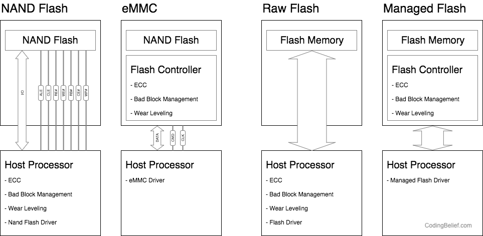
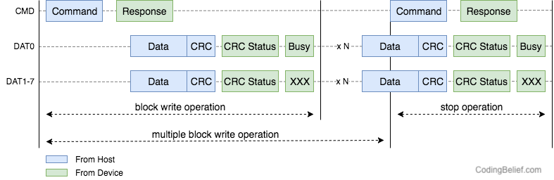

本页主要用于测试主题样式，包含各个不同元素。

<!-- more -->

> 
> `主题` 测试
>

# 列表测试
- 列表 -
- 列表 -
- 列表 -

+ 列表 +
+ 列表 +
+ 列表 +

3. 列表 3
5. 列表 5
7. 列表 7

# Header 测试 H1
## 这个是 H2
### 这个是 H3
#### 这个是 H4
##### 这个是 H5

# 代码测试

## Bash 代码

``` bash
$ hexo new "My New Post"
$ hexo server
$ hexo generate
$ hexo deploy
```

## JavaScript 代码

``` javascript

function covertToInt16(byteL, byteH) {
  if (byteH > 127) {
    byteH = -(256 - byteH);
  }

  return byteH * 256 + byteL;
}

function covertToUInt16(byteL, byteH) {
  return byteH * 256 + byteL;
}

```

# 表格测试

## 表格 1

| Symbol | Type | Description |
| -- | -- | -- |
| CLK | Input | 从 Host 端输出的同步时钟信号 |
| CKE | Input | 用于指示 CLK 信号是否有效，SDRAM 会根据此信号进入或者退出 Power down、Self-refresh 等模式 |
| CS# | Input | Chip Select 信号 |
| CAS# | Input | Column Address Strobe，列地址选通信号 |
| RAS# | Input | Row Address Strobe， 行地址选通信号 |
| WE# | Input | Write Enable，写使能信号 |
| DQML | Input | 当进行写数据时，如果该 DQML 为高，那么 DQ[7:0] 的数据会被忽略，不写入到 DRAM |
| DQMH | Input | 当进行写数据时，如果该 DQMH 为高，那么 DQ[15:8] 的数据会被忽略，不写入到 DRAM |
| BA[1:0] | Input | Bank Address，用于选择操作的 Memory Bank |
| A[12:0] | Input | Address 总线，用于传输行列地址 |
| DQ[15:0] | I/O | Data 总线，用于传输读写的数据内容 |

## 表格 2

<a name="表格-1-1" class="table-caption">表格 1-1</a>

| DDR SDRAM Standard | Bus clock (MHz) | Internal rate (MHz) | Prefetch (min burst) | Transfer Rate (MT/s) | Voltage |
| -- | -- | -- | -- | -- | -- |
| DDR | 100–200 | 100–200 | 2n | 200–400 | 2.5/2.6 |
| DDR2 | 200–533.33 | 100–266.67 | 4n | 400–1066.67 | 1.8 |
| DDR3 | 400–1066.67 | 100–266.67 |8n | 800–2133.33 | 1.5 | 
| DDR4 | 1066.67–2133.33 | 133.33–266.67 | 8n | 2133.33–4266.67 | 1.05/1.2 |


# 图片测试

## 图片 1

<a name="图片-1-1" class="img-caption">图片 1</a>



## 图片 2



# Note 测试

 Content (default)   

 Content (success)   

 Content (primary)   

 Content (info) 

 Content (warning) 

 Content (danger) 


# 链接测试

1. [Everything You Need To Know About DDR, DDR2 and DDR3 Memories [WEB]](http://www.hardwaresecrets.com/everything-you-need-to-know-about-ddr-ddr2-and-ddr3-memories/)
2. [記憶體10年技術演進史 [WEB]](http://www.techbang.com/posts/17190)

[`表格 1`](#表格-1-1)
[图片 1](#图片-1-1)


